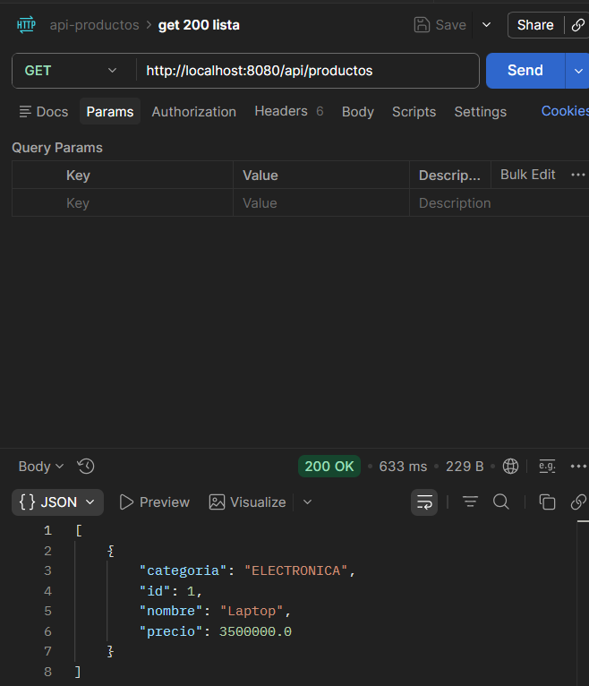
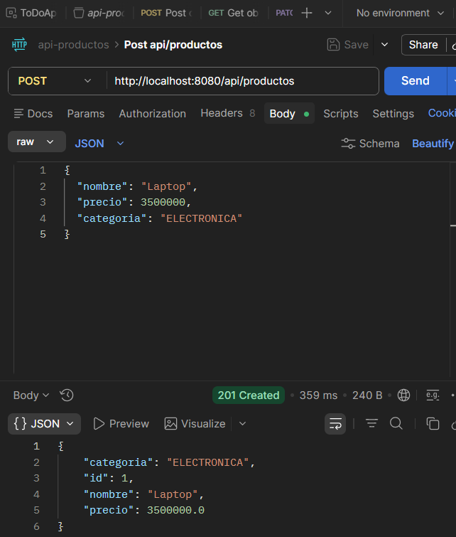
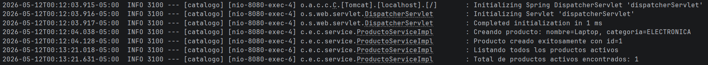
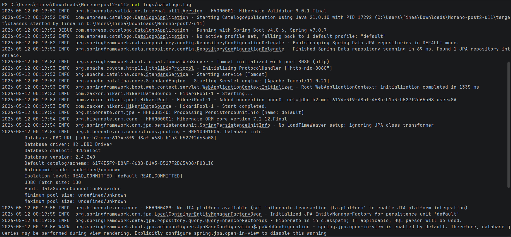
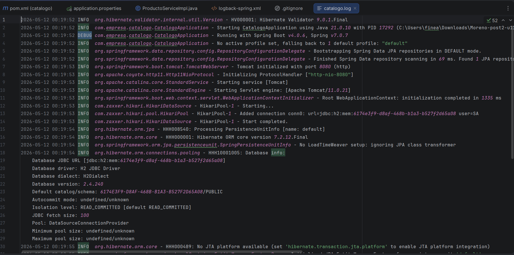
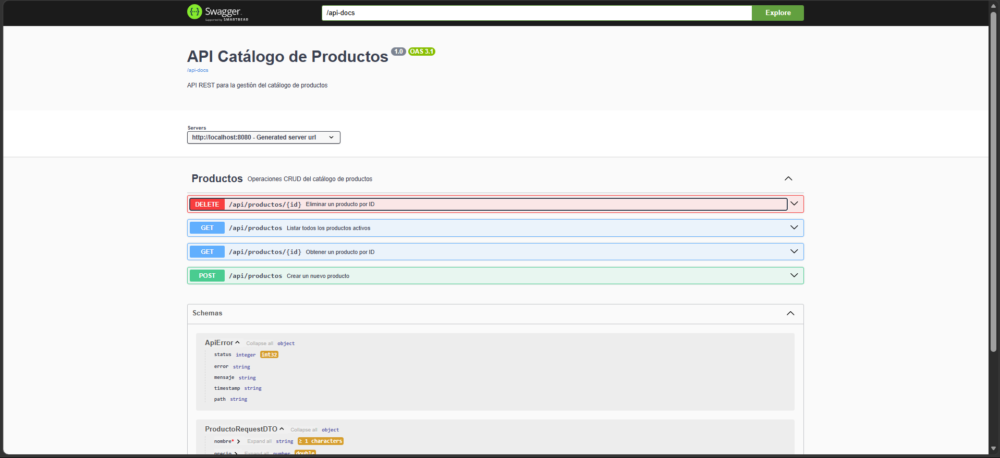
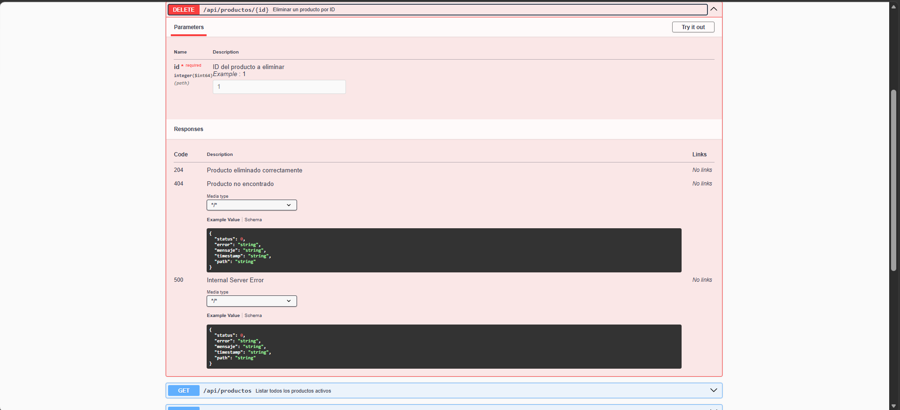

## Catálogo de Productos — Post-Contenido 2 | Unidad 11

**Programación Web — Ingeniería de Sistemas**  
**Universidad de Santander (UDES) — 2026**

Extensión del Post-Contenido 1: se integra **SLF4J/Logback** para registro de
eventos con niveles apropiados y rotación de archivos, y se documenta la API REST
completa con **springdoc-openapi**, generando una Swagger UI interactiva.
 
---

## Estructura del proyecto

```
Moreno-post2-u11/
├── src/
│   └── main/
│       ├── java/com/empresa/catalogo/
│       │   ├── CatalogoApplication.java          # @OpenAPIDefinition
│       │   ├── controller/
│       │   │   └── ProductoController.java        # @Tag @Operation @ApiResponses
│       │   ├── service/
│       │   │   ├── ProductoService.java           # Interfaz (DIP)
│       │   │   └── ProductoServiceImpl.java       # Logger SLF4J integrado
│       │   ├── repository/
│       │   │   └── ProductoRepository.java        # DAO
│       │   ├── dto/
│       │   │   ├── ProductoRequestDTO.java        # @Schema en campos
│       │   │   └── ProductoResponseDTO.java
│       │   ├── entity/
│       │   │   └── Producto.java
│       │   ├── factory/
│       │   │   └── ProductoFactory.java
│       │   └── exception/
│       │       ├── ApiError.java
│       │       ├── GlobalExceptionHandler.java
│       │       └── RecursoNoEncontradoException.java
│       └── resources/
│           ├── application.properties             # Config Swagger
│           └── logback-spring.xml                 # Config Logback
├── logs/                                          # Generado al ejecutar (en .gitignore)
│   └── catalogo.log
├── .gitignore
└── pom.xml
```
 
---

## Prerrequisitos

| Herramienta   | Versión       |
|---------------|---------------|
| Java          | 21            |
| Maven         | 3.9.x         |
| Spring Boot   | 4.0.6         |

**Dependencias principales (`pom.xml`):**
- `spring-boot-starter-web` — incluye Logback automáticamente
- `spring-boot-starter-data-jpa`
- `spring-boot-starter-validation`
- `com.h2database:h2`
- `org.springdoc:springdoc-openapi-starter-webmvc-ui:2.8.8`
---

## Cómo ejecutar

**1. Clonar el repositorio**
```bash
git clone https://github.com/<tu-usuario>/Moreno-post2-u11.git
cd Moreno-post2-u11
```

**2. Compilar el proyecto**
```bash
mvn compile
```

**3. Iniciar la aplicación**
```bash
mvn spring-boot:run
```

La API queda disponible en: `http://localhost:8080`

---

### Ejemplo — Crear producto (POST)

**Request:**
```http
POST /api/productos
Content-Type: application/json
 
{
  "nombre": "Laptop HP ProBook",
  "precio": 3500000,
  "categoria": "ELECTRONICA"
}
```

**Response `201 Created`:**
```json
{
  "id": 1,
  "nombre": "Laptop HP ProBook",
  "precio": 3500000.0,
  "categoria": "ELECTRONICA"
}
```

### Ejemplo — Error 404

```http
GET /api/productos/999
```

```json
{
  "status": 404,
  "error": "Not Found",
  "mensaje": "Producto con id 999 no encontrado.",
  "timestamp": "2026-05-12T10:30:00",
  "path": "/api/productos/999"
}
```

### Ejemplo — Error 400 (validación)

```http
POST /api/productos
Content-Type: application/json
 
{}
```

```json
{
  "status": 400,
  "error": "Bad Request",
  "mensaje": "nombre: El nombre es obligatorio; precio: El precio debe ser mayor a cero",
  "timestamp": "2026-05-12T10:30:00",
  "path": "/api/productos"
}
```
 
---

## Documentación interactiva — Swagger UI

Con la aplicación corriendo, accede a:

```
http://localhost:8080/swagger-ui/index.html
```

También disponible en:
```
http://localhost:8080/swagger-ui.html
```

El JSON de la especificación OpenAPI se encuentra en:
```
http://localhost:8080/api-docs
```

La interfaz muestra el grupo **"Productos"** con los 4 endpoints documentados,
incluyendo esquemas de request/response, ejemplos de valores y todos los
códigos de respuesta posibles (200, 201, 400, 404).
 
---

### Ver logs en consola

Los mensajes aparecen en consola con este formato:
```
HH:mm:ss NIVEL  logger - mensaje
```

Ejemplo real:
```
10:35:22 INFO  c.e.c.service.ProductoServiceImpl - Creando producto: nombre=Laptop, categoria=ELECTRONICA
10:35:22 INFO  c.e.c.service.ProductoServiceImpl - Producto creado exitosamente con id=1
10:35:25 INFO  c.e.c.service.ProductoServiceImpl - Listando todos los productos activos
10:35:30 WARN  c.e.c.service.ProductoServiceImpl - Producto con id=999 no encontrado
```

### Ubicación del archivo de log

```
logs/catalogo.log
```

El archivo se crea automáticamente al iniciar la aplicación. Formato del archivo:
```
yyyy-MM-dd HH:mm:ss NIVEL  logger - mensaje
```

Ejemplo:
```
2026-05-12 10:35:22 INFO  com.empresa.catalogo.service.ProductoServiceImpl - Producto creado exitosamente con id=1
2026-05-12 10:35:30 WARN  com.empresa.catalogo.service.ProductoServiceImpl - Producto con id=999 no encontrado
```

**Rotación:** diaria, con historial de 30 días.  
**Archivos rotados:** `logs/catalogo.YYYY-MM-DD.log`

> La carpeta `logs/` está en `.gitignore` y no se sube al repositorio.

---

## Evidencias

- Get 200


- Post 201


- Get, Post terminal


- cat catalogo.log


- Catalogo.log


- Swagger interface


- Swagger endpoint
